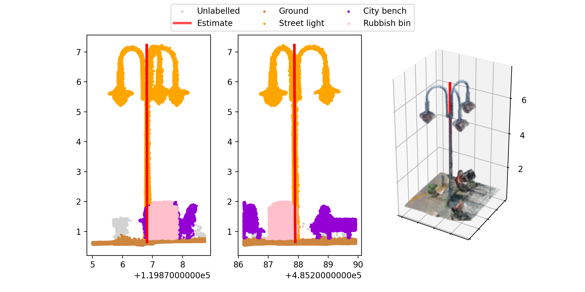

# Extracting urban street furniture from labeled point clouds

This repository contains methods for the **automatic extraction of urban street furniture** from labeled PointClouds. It serves as a post-processing toolbox for our [data fusion labeling approach](https://github.com/Amsterdam-AI-Team/Urban_PointCloud_Processing), but it can also be used for point clouds that were labeled manually or by semantic segmentation algorithms, with minor modifications.

This is very much work in progress: for now, we only provide code to extract the location of pole-like objects. Further methods to extract other types of street furniture will follow. For more background on this project, please have a look at our accompanying [blog post](https://amsterdamintelligence.com/posts/locating-street-lights-in-point-clouds-using-deep-learning).

<figure align="center">
  
  <figcaption><b>Example:</b> visualization of one extracted pole.</figcaption>
</figure>

---

## Folder Structure

 * [`datasets`](./datasets) _Demo dataset to get started_
   * [`ahn`](./datasets/ahn) _AHN elevation data_
   * [`pointcloud`](./datasets/pointcloud) _Example labeled urban point clouds_
 * [`media/examples`](./media/examples) _Visuals_
 * [`notebooks`](./notebooks) _Jupyter notebook tutorials_
 * [`src/upc_analysis`](./src/upc_analysis) _Python source code_

---

## Installation

1. Clone this repository:
    ```bash
    git clone https://github.com/Amsterdam-AI-Team/Urban_PointCloud_Analysis.git
    ```

2. Install the dependencies:
    ```bash
    pip install -r requirements.txt
    # optional requirements for Jupyter notebooks:
    pip install -r requirements-notebooks.txt
    ```

3. Additionally, install our [Urban PointCloud Processing](https://github.com/Amsterdam-AI-Team/Urban_PointCloud_Processing) package:
    ```bash
    pip install https://github.com/Amsterdam-AI-Team/Urban_PointCloud_Processing/releases/download/v0.1/upcp-0.1-py3-none-any.whl
    ```

4. Finally, install `cccorelib` and `pycc` by following the [instructions on their GitHub page](https://github.com/tmontaigu/CloudCompare-PythonPlugin/blob/master/docs/building.rst#building-as-independent-wheels). Please note, these two packages are not available on the Python Package Index (PyPi).

5. Check out the [notebooks](notebooks) for a demonstration.

---

## Usage

We provide tutorial [notebooks](notebooks) that demonstrate how the tools can be used. Labeled example point clouds are provided to get started.

0. Get labeled point clouds (for example with [UPCP](https://github.com/Amsterdam-AI-Team/Urban_PointCloud_Processing) or [RandLA-Net](https://github.com/Amsterdam-AI-Team/RandLA-Net)).
1. Run Extract_poles.ipynb to extract all individual poles with some properties. It returns a csv file with one row per pole.
2. Run Visualize_poles.ipynb (or visualize_poles.py) to create images for each pole. It returns 3 images per pole.
3. Run the [pole tagger tool](https://github.com/Amsterdam-AI-Team/pole_tagger) to check all individual poles visually.
4. (optional) Run the [validation tool](https://github.com/Amsterdam-AI-Team/pole_tagger) to check and fix pole tagger results.

NB. The notebooks Dataset_statics and Get_valid_locations are for additional analysis. 

## Contributing

Feel free to help out! [Open an issue](https://github.com/Amsterdam-AI-Team/{{ cookiecutter.repo_name }}/issues), submit a [PR](https://github.com/Amsterdam-AI-Team/{{ cookiecutter.repo_name }}/pulls) or [contact us](https://amsterdamintelligence.com/contact/).

## Acknowledgements

This repository was created by [Amsterdam Intelligence](https://amsterdamintelligence.com/) for the City of Amsterdam.

## License 

This project is licensed under the terms of the European Union Public License 1.2 (EUPL-1.2).
